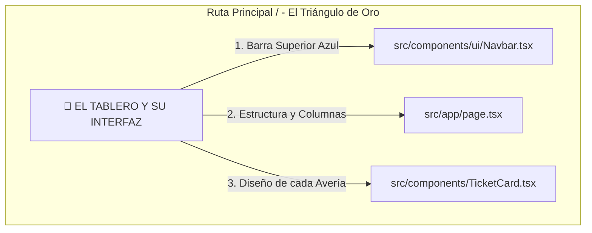
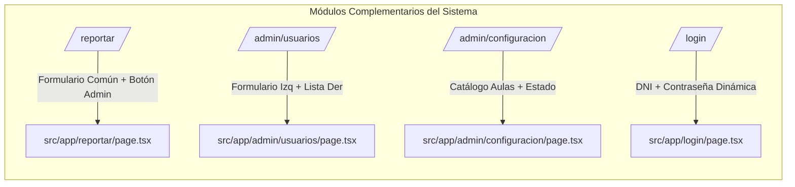
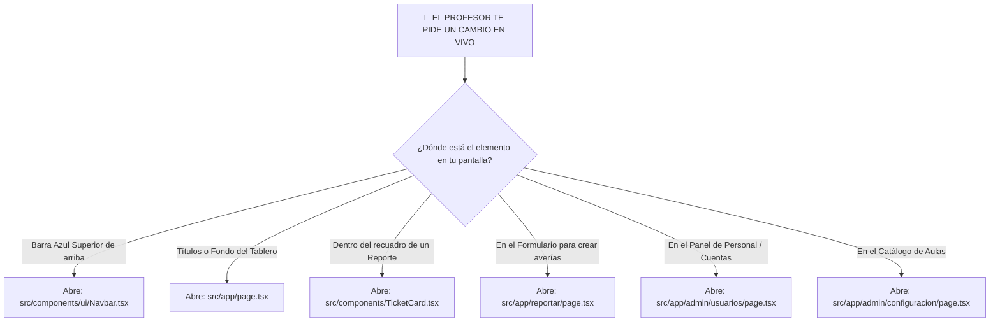

# 🏛️ GUÍA DEFINITIVA DE INTERFACES, UBICACIÓN Y ARQUITECTURA VISUAL
## PROYECTO PUYO — SISTEMA DE GESTIÓN DE INCIDENCIAS (SOP SUIZA)
> **Documento Maestro de Estudio y Referencia Inmediata para Modificaciones en Vivo (Live Coding)**  
> **Objetivo Académico:** Asegurar una calificación $\ge 17/20$ en la sustentación de recuperación.  
> 🔗 **Enlace Directo a Simulacro Práctico y Léxico de Ingeniería:** [Ver Simulacro de Alta Rigurosidad](file:///C:/Users/Geric/Desktop/WorkSpace/Proyecto_Puyo/SIMULACRO_EXAMEN_ALTA_RIGUROSIDAD.md) | [Ver Mapa Rápido de Pantallas](file:///C:/Users/Geric/Desktop/WorkSpace/Proyecto_Puyo/MAPA_VISUAL_INTERFACES_POR_ROL.md) | [Ver Retos en Vivo 10s](file:///C:/Users/Geric/Desktop/WorkSpace/Proyecto_Puyo/GUIA_EXAMEN_MODIFICACIONES_EN_VIVO.md)

---

## 🛑 1. EL PRINCIPIO ARQUITECTÓNICO FUNDAMENTAL (RESPUESTA DE 20 PUNTOS AL JURADO)
En frameworks modernos con renderizado del servidor y cliente unificado como **Next.js 14 App Router + React + Tailwind CSS**, debes memorizar esta verdad técnica:

> [!IMPORTANT]
> **NO EXISTEN ARCHIVOS O RUTAS SEPARADAS PARA CADA ROL**  
> No busques un archivo llamado `estudiante/page.tsx` ni `docente/page.tsx`. Todos los roles (`USER`, `DOCENTE`, `ADMIN`) cargan y visualizan exactamente **los mismos archivos maestros de la carpeta `src/app/` y `src/components/`**.

### ❓ ¿Por qué entonces la pantalla cambia si entra un Administrador o un Estudiante?
Porque dentro de los archivos maestros implementamos **Renderizado Condicional Dinámico (`if / &&`)** en TypeScript. El componente evalúa en milisegundos la sesión (`user?.rol === 'ADMIN'`). Si eres Administrador, el código activa botones de control, paneles flotantes y menús exclusivos; si eres un Estudiante o Docente, el DOM oculta esos nodos al instante.

---

## 🌟 2. EL "TRIÁNGULO DE ORO" (EL 90% DE PROBABILIDAD DE EXAMEN)
Durante una defensa práctica (*Live Coding*), el jurado quiere evaluar tu agilidad sin perder tiempo navegando por sub-menús ocultos. El **90% de las modificaciones visuales** que te pedirán en caliente ocurrirán en la pantalla principal (`/`), la cual se divide milimétricamente en **3 archivos maestros**:

---

### 1️⃣ `src/components/ui/Navbar.tsx` — La Barra de Navegación Superior
Es el componente de tipo `Server Component` que permanece fijo al tope de todas las pantallas (`sticky top-0 z-50`).

* **¿Qué se dibuja aquí exactamente?**
  * El escudo oficial `Logo-suiza.png` y el título `"IESTP Suiza - Portal de Incidencias"`.
  * El nombre y rol del usuario conectado (*Ej. Omar Farhan Sahi - Administrador*).
  * Los enlaces de navegación del menú (`Tablero`, `Usuarios`, `Configuración`).
  * La campana de alertas rojas en tiempo real (`NotificationBell`).
  * El botón rojo primario `+ Nuevo Reporte`.
* **Coordenadas y Líneas Quirúrgicas para Cambios Rápidos:**
  * **Línea 23:** Título del Instituto (`<h1 className="...">IESTP Suiza</h1>`). *Ideal si piden cambiar por "IESTP Suiza 2026"*.
  * **Línea 33:** Etiqueta del rol visual (`user.rol === 'ADMIN' ? 'Administrador' : ...`).
  * **Línea 47:** **Interruptor de Seguridad Visual (`{user?.rol === 'ADMIN' && (...)}`)**. Esta línea es la que oculta `Usuarios` y `Configuración` si quien entra no es administrador.
  * **Línea 61:** Botón **`+ Nuevo Reporte`** (`className="bg-red-600 hover:bg-red-700..."`). *Si piden cambiar el color del botón a verde, aquí reemplazas `bg-red-600` por `bg-emerald-600`*.

---

### 2️⃣ `src/app/page.tsx` — El Tablero Principal (Contenedor Orquestador)
Es el `Client Component` principal que consulta la API (`/api/incidencias`) y organiza las averías en la pantalla.

* **¿Qué se dibuja aquí exactamente?**
  * El encabezado superior `"Panel de Control"` y su descripción.
  * La separación de los datos en dos columnas visuales: **Turno Mañana** (`☀️`) y **Turno Tarde** (`🌙`).
  * La tarjeta blanca de estado vacío `"Sistemas al 100%"` cuando todas las incidencias han sido solucionadas.
* **Coordenadas y Líneas Quirúrgicas para Cambios Rápidos:**
  * **Línea 61:** Título principal (`<h2>Panel de Control</h2>`). *Si piden cambiar por "Tablero Central SOP", lo editas aquí*.
  * **Línea 67:** **ZONA ESTRATÉGICA PARA BANNER O AVISO GENERAL**. Si el jurado dice *"Pon una alerta amarilla en el tablero que la vean todos los alumnos"*, pegas tu `
` justo en esta línea.
  * **Líneas 68 a 80:** La tarjeta de tablero vacío (`incidencias.length === 0`). Contiene el título `"Sistemas al 100%"` y el botón central `"Crear Nuevo Reporte"` (Línea 78).
  * **Líneas 85 y 102:** Títulos de las columnas (`Turno Mañana` y `Turno Tarde`). *Si piden cambiar los íconos de Sol y Luna o juntar todo en una columna, se modifica este bloque*.

---

### 3️⃣ `src/components/TicketCard.tsx` — La Tarjeta Individual de Avería
Aunque las tarjetas aparecen dentro de las columnas de `page.tsx`, su código visual y modular vive en este archivo (*Presentational Component*).

* **¿Qué diferencia visual ve cada rol dentro de la tarjeta?**
  * **Estudiante (`USER`) y Docente (`DOCENTE`):** Ven el código de avería (`#0001`), título, descripción, semáforo (`Pendiente`/`Solucionado`), fotografías, aula, fecha y autor.
  * **Administrador (`ADMIN`):** Ve exactamente todo lo anterior, **MÁS EL BOTÓN INFERIOR: `Marcar como Solucionado`**.
* **Coordenadas y Líneas Quirúrgicas para Cambios Rápidos:**
  * **Línea 17:** Colores dinámicos del Semáforo (`isPending ? 'bg-red-50 text-red-700' : 'bg-emerald-50 text-emerald-700'`). *Si te piden semáforo amarillo cuando está pendiente, aquí modificas a `'bg-amber-100 text-amber-800'`*.
  * **Línea 71:** **ZONA ESTRATÉGICA PARA NUEVOS BOTONES**. Si te piden *"Agrega un botón 'Ver Detalle' o 'Imprimir' en cada avería para todos los usuarios"*, pegas tu botón justo encima del cierre de este bloque.
  * **Línea 73:** **Condición del botón exclusivo de resolución (`{isPending && isAdmin && ...}`)**. *Si te piden que el DOCENTE también pueda ver este botón, cambias la condición a `{isPending && (isAdmin || incidencia.usuario?.rol === 'DOCENTE')}` — [Ver explicación técnica en Simulacro](file:///C:/Users/Geric/Desktop/WorkSpace/Proyecto_Puyo/SIMULACRO_EXAMEN_ALTA_RIGUROSIDAD.md#escenario-2-modificación-de-reglas-de-negocio-y-roles-en-el-cliente-ticketcardtsx)*.

---

## 🗺️ 3. DESGLOSE DEL 10% RESTANTE: LAS OTRAS 4 PANTALLAS DEL SISTEMA

Si el jurado decide evaluarte en las pantallas internas del menú, aquí tienes el mapa milimétrico de cada una:

### 📝 1. Formulario de Registro de Averías (`src/app/reportar/page.tsx`)
* **URL en navegador:** `/reportar`
* **¿Quién entra aquí?** Todos los usuarios al presionar `+ Nuevo Reporte`.
* **Diferencia por rol en pantalla:**
  * **USER / DOCENTE:** Ven los campos de Título, Selector de Aulas (`<select>`), Descripción y Subida de Fotos (`FormData`).
  * **ADMIN:** Ve lo mismo, **MÁS UN BOTÓN AZUL SOBRE EL SELECTOR QUE DICE: `⚙️ Administrar Ubicaciones (Admin)` (Línea 190)**. Al hacerle clic, abre un panel express para crear o borrar laboratorios en caliente sin salir del formulario.
* **Coordenadas y Líneas Quirúrgicas:**
  * **Línea 107 (`handleSubmit`):** Función que empaqueta las fotos y datos antes de enviar. *[Ver cómo agregar validación de 20 caracteres aquí](file:///C:/Users/Geric/Desktop/WorkSpace/Proyecto_Puyo/SIMULACRO_EXAMEN_ALTA_RIGUROSIDAD.md#escenario-4-agregar-validación-estricta-en-formulario-de-reporte-srcappreportarpagetsx)*.
  * **Línea 175:** Input del Título del Problema (`name="titulo"`).
  * **Líneas 203 a 214:** El selector desplegable de aulas (`<select name="aula">`).
  * **Línea 312:** Zona encima del `textarea` de descripción ideal para insertar nuevos campos, como un selector de *Prioridad (Alta/Baja)*.

---

### 👥 2. Panel de Gestión de Usuarios (`src/app/admin/usuarios/page.tsx`)
* **URL en navegador:** `/admin/usuarios`
* **¿Quién entra aquí?** **Exclusivamente Administradores (`user.rol === 'ADMIN'`)** al presionar `Usuarios` en el Navbar.
* **Estructura Visual en Pantalla (`grid-cols-1 lg:grid-cols-3`):**
  * **Columna Izquierda (`lg:col-span-1` - Línea 110):** Formulario `Registrar Usuario` (DNI, Nombres, Turno y select de Rol `USER/DOCENTE/ADMIN`).
  * **Columna Derecha (`lg:col-span-2` - Línea 160):** Lista de tarjetas con el equipo (*Christian Jhoel, Cristiam Saul, Anllely, Directora Jacobo, Geric y Omar*).
* **Coordenadas y Líneas Quirúrgicas:**
  * **Línea 99:** Título del módulo (`<h2>Gestión de Usuarios</h2>`).
  * **Línea 104:** **ZONA ESTRATÉGICA PARA CONTADOR TOTAL**. *Si te piden poner el número de cuentas activas, insertas `
Total: {usuarios.length}
` en esta línea*.
  * **Línea 163:** Círculo que extrae la inicial (`u.nombres.charAt(0)`) con color dinámico rojo/verde/azul.
  * **Línea 169:** Escudo rojo de alerta (`ShieldAlert`) que aparece al lado del nombre de los administradores.
  * **Líneas 180 y 183:** Botones de acción individual **`Editar`** (`handleEdit`) y **`Eliminar`** (`handleDelete`). *Al eliminar, el backend limpia en cascada las incidencias asociadas para no romper la BD — [Ver detalle en API](file:///C:/Users/Geric/Desktop/WorkSpace/Proyecto_Puyo/SIMULACRO_EXAMEN_ALTA_RIGUROSIDAD.md#qué-pasa-cuando-haces-clic-en-eliminar-y-por-qué-no-explota-la-bd)*.

---

### ⚙️ 3. Panel Maestro de Configuración (`src/app/admin/configuracion/page.tsx`)
* **URL en navegador:** `/admin/configuracion`
* **¿Quién entra aquí?** **Exclusivamente Administradores (`user.rol === 'ADMIN'`)** al presionar `Configuración` en el Navbar.
* **Estructura Visual en Pantalla:**
  * **Tarjeta Izquierda (`lg:col-span-2` - Línea 147):** Catálogo central de Aulas y Laboratorios. Cuenta con una barra de texto (`input`) con el botón rojo `+ Agregar`, y la tabla interactiva donde puedes editar nombres o borrar aulas (`Trash2`).
  * **Tarjeta Derecha (Línea 263):** Panel informativo `Estado del Sistema Maestro` (Módulo de Restablecimiento y Sincronización Dinámica).
* **Coordenadas y Líneas Quirúrgicas:**
  * **Línea 133:** Título principal (`<h1>Panel Maestro de Configuración</h1>`).
  * **Línea 164:** Formulario express para escribir el nombre del nuevo laboratorio (`input value={nuevaUbicacion}`).
  * **Líneas 193 a 257:** Bucle `ubicaciones.map(...)` que dibuja cada ambiente activo con sus botones de edición rápida en tiempo real.

---

### 🔐 4. Pantalla de Inicio de Sesión (`src/app/login/page.tsx`)
* **URL en navegador:** `/login`
* **¿Quién entra aquí?** Cualquier usuario que ingresa por primera vez o tras cerrar sesión.
* **Comportamiento Dinámico e Inteligente en Pantalla:**
  * Al principio, la pantalla **solo muestra el input para ingresar el DNI de 8 dígitos** (`Línea 135`).
  * Si el DNI pertenece a un estudiante o docente, el sistema lo identifica y permite ingresar directo al hacer clic.
  * Si el DNI pertenece a un Administrador (`isAdminRole === true`), el componente **despliega con animación suave la casilla de Contraseña de Administrador (Línea 141)** y la opción *"¿Olvidaste tu contraseña?"* (`Línea 159`).
* **Coordenadas y Líneas Quirúrgicas:**
  * **Línea 115:** Título institucional superior (`<h1>IESTP Suiza</h1>`).
  * **Línea 121:** Título de la tarjeta (`<h2>{recoveryMode ? "Recuperar Contraseña" : "Iniciar Sesión"}</h2>`).
  * **Línea 221:** Botón principal de acceso (`<button type="submit">Ingresar al Sistema</button>`).

---

## ⚡ 4. PROTOCOLO DE REACCIÓN MILITAR EN 3 SEGUNDOS (TU REFLEJO FRENTE AL PROFESOR)

Cuando el jurado te dé una orden en vivo, sigue este diagrama de decisión mental instantáneo:

### 🔗 VINCULACIÓN MAESTRA CON EL SIMULACRO DE INGENIERÍA:
Para repasar la argumentación técnica con palabras de nivel de ingeniero de software y ver los códigos listos para copiar y pegar en caso de que te pidan alterar base de datos (`Prisma`), tiempos del Cron (`route.ts`) o validaciones de formulario, haz clic directamente aquí:
👉 **[Ir al Simulacro y Auditoría de Alta Rigurosidad (SIMULACRO_EXAMEN_ALTA_RIGUROSIDAD.md)](file:///C:/Users/Geric/Desktop/WorkSpace/Proyecto_Puyo/SIMULACRO_EXAMEN_ALTA_RIGUROSIDAD.md)**

---

## 🤝 RESUMEN DEL PROTOCOLO DE APOYO CON ANTIGRAVITY DURANTE EL EXAMEN
1. Si el profesor te solicita una modificación atípica que no recuerdas cómo escribir al instante, dile con tranquilidad y confianza: *"Por supuesto, profesor. Procederé a alterar el Client Component / Server Component para aplicar la modificación estructural."*
2. Escríbeme de inmediato al chat el pedido exacto.
3. Te entregaré en **10 segundos cronometrados** el archivo, la línea milimétrica y el bloque de código estrictamente tipado en TypeScript para que lo apliques frente al jurado y asegures tu 17 o más. 🏆🎓
