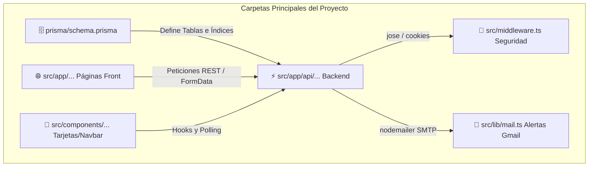

# 📚 GUÍA DE UBICACIÓN Y ESTUDIO RÁPIDO (SOP SUIZA)
> **Documento Oficial de Referencia Rápida para la Sustentación del Proyecto Puyo**  
> *IESTP Suiza - Portal de Gestión de Incidencias en Tiempo Real*

---

## 🏛️ Mapa Arquitectónico General (`Next.js 14 App Router + Prisma`)

El siguiente diagrama muestra cómo se conectan las 4 carpetas principales de nuestro proyecto:

---

## 📂 Desglose Estructurado de Directorios y Archivos

### 🗄️ 1. Base de Datos (`prisma/`)
| Archivo | Qué contiene y para qué sirve en la sustentación |
| :--- | :--- |
| **`prisma/schema.prisma`** | Aquí están escritas nuestras 4 tablas (`Usuario`, `Incidencia`, `Ubicacion`, `Notificacion`). Explica cómo están conectadas (`relation`) y la importancia de los **índices relacionales y de limpieza automática** (`@@index`). |

### 🌐 2. Frontend y Backend (`src/app/`)
| Archivo / Ruta | Tipo | Qué hace en línea por línea o concepto por concepto |
| :--- | :---: | :--- |
| **`src/app/page.tsx`** | *Client Component* | **Tablero Principal:** Hace `fetch("/api/incidencias")`, divide el arreglo según el turno en dos columnas (`turnomanana` y `turnotarde`) y maneja el botón para resolver averías. |
| **`src/app/login/page.tsx`** | *Client Component* | **Pantalla de Inicio de Sesión:** Pide el DNI y contraseña al administrador. Llama a `/api/auth/login`. |
| **`src/app/reportar/page.tsx`** | *Client Component* | **Formulario de Registro de Averías:** Donde el estudiante elige el aula, describe el fallo y adjunta fotos. En la función `handleSubmit`, empaqueta todo en un objeto binario **`FormData`** para permitir subida multimedia. |
| **`src/app/admin/configuracion/page.tsx`** | *Client Component* | **Panel de Gestión de Aulas:** Permite al administrador crear (`POST`) o editar laboratorios dinámicamente sin tocar código. |
| **`src/app/api/incidencias/route.ts`** | **API Route (Back)** | **¡EL ARCHIVO ESTRELLA DEL SERVIDOR!** • **`GET()`**: Ejecuta el **Cron de 24 horas** (`deleteMany` para incidencias resueltas hace un día) y devuelve las tarjetas. • **`POST()`**: Guarda fotos físicas en `/public/uploads/` con nombre único (`Date.now()`), inserta en PostgreSQL, enciende la campanita roja (`prisma.notificacion.create`) y dispara en segundo plano el correo electrónico de Gmail. |
| **`src/app/api/auth/login/route.ts`** | **API Route (Back)** | **Lógica de Autenticación:** Valida DNI en PostgreSQL. Si un `ADMIN` entra por primera vez (`password === null`), autoguarda la contraseña que escribió. Crea la cookie encriptada JWT. |

### 🧩 3. Componentes Reutilizables (`src/components/`)
| Archivo | Qué hace y por qué es modular |
| :--- | :--- |
| **`src/components/TicketCard.tsx`** | **Tarjeta de Incidencia:** Dibuja el **semáforo visual** (Semáforo Rojo para `Pendiente`, Verde para `Solucionado`), la cuadrícula de fotografías (`grid-cols-2`) y el botón exclusivo para el administrador (`onResolver`). |
| **`src/components/ui/Navbar.tsx`** | **Barra Superior (*Server Component*):** Consulta la sesión en el servidor (`getSession()`). Muestra el logo del IESTP Suiza y oculta botones sensibles (`Usuarios` y `Configuración`) si no eres administrador. |
| **`src/components/ui/NotificationBell.tsx`** | **Campanita de Alertas 🔔:** Hace un *polling* cada 15 segundos hacia `/api/notificaciones` para verificar si hay nuevas emergencias no leídas (`leido: false`) y muestra el contador en rojo sobre la campana. |
| **`src/components/ui/NavbarWrapper.tsx`** | **Envoltura Inteligente:** Oculta el menú superior de navegación únicamente cuando estás en la pantalla de `/login`. |

### 🛠️ 4. Seguridad, Librerías y Guardián (`src/lib/` y `src/middleware.ts`)
| Archivo | Qué explicarle al profesor si te pregunta por seguridad o correos |
| :--- | :--- |
| **`src/middleware.ts`** | **El Guardián del Sistema:** Se ejecuta antes de cargar cualquier página. Valida criptográficamente la firma digital de la cookie con `jwtVerify` de `jose`. Si no estás autenticado, te manda al login; si intentas entrar a `/admin` sin ser administrador, te patea al Tablero. |
| **`src/lib/auth.ts`** | **Criptografía de Sesión:** Contiene `createSession` y `getSession`. Crea tokens JWT con expiración de 24 horas y los guarda en cookies con atributo `httpOnly: true` para que ningún script maligno de JavaScript pueda robarlos (`XSS protection`). |
| **`src/lib/mail.ts`** | **Módulo de Correo Gmail (`Nodemailer`):** Conecta con el servidor seguro `smtp.gmail.com:465` usando variables de entorno secretas (`EMAIL_PASS`). Aquí dentro vive la variable `htmlContent` que contiene el diseño visual HTML/CSS institucional color azul marino con el logo del IESTP Suiza. |

---

## 🛡️ Preguntas "Fastidiosas" del Profesor y sus Respuestas Inmediatas

> [!IMPORTANT]
> **Si el profesor te dice: *"A ver Geric, ¿dónde está programado el semáforo visual que cambia la tarjeta de rojo a verde?"***  
> **Tu Respuesta:** *"Profesor, eso está modularizado en el componente `src/components/TicketCard.tsx` (líneas 13-20), donde evaluamos si la variable `incidencia.estado === 'Pendiente'` para aplicar la clase CSS de fondo rojo `bg-red-50 text-red-700` o fondo verde `bg-emerald-50 text-emerald-700`."*

> [!IMPORTANT]
> **Si el profesor te dice: *"Muéstrame cómo funciona el Cron o la limpieza de tarjetas viejas de la que hablaron en su diapositiva 9."***  
> **Tu Respuesta:** *"Profesor, por favor abra el archivo `src/app/api/incidencias/route.ts` en la función `GET()` (líneas 9-18). Ahí calculamos la fecha exacta de hace 24 horas con `Date.now() - 24 * 60 * 60 * 1000` y ejecutamos `prisma.incidencia.deleteMany(...)` para depurar automáticamente los registros ya solucionados sin sobrecargar el servidor."*

> [!IMPORTANT]
> **Si el profesor te pregunta: *"¿Cómo hicieron para que se envíen fotos e información al mismo tiempo en el reporte?"***  
> **Tu Respuesta:** *"En `src/app/reportar/page.tsx` dentro de `handleSubmit` no enviamos un JSON tradicional, sino un objeto binario **`FormData`**. Adjuntamos los textos y recorremos con un `forEach` el arreglo de archivos físicos `archivos`. Luego, en el backend (`/api/incidencias`), Node.js los guarda físicamente en `/public/uploads/` con una marca de tiempo única."*

> [!IMPORTANT]
> **Si el profesor te pregunta: *"¿Y cómo lograron que el correo que llega al Gmail del administrador tenga un diseño HTML azul tan profesional?"***  
> **Tu Respuesta:** *"En el archivo `src/lib/mail.ts` configuramos el transporte seguro `nodemailer` hacia `smtp.gmail.com` usando clave de aplicación de 16 dígitos encriptada en `.env`. Dentro de la función `enviarCorreoNuevaIncidencia()`, estructuramos una plantilla HTML con estilos inline `background-color: #1e3a8a` e inyectamos dinámicamente las variables de aula, título, DNI del estudiante y fecha en tiempo real."*

---
*IESTP Suiza - 2026 | Sistema Operativo y de Soporte (SOP Suiza)*
